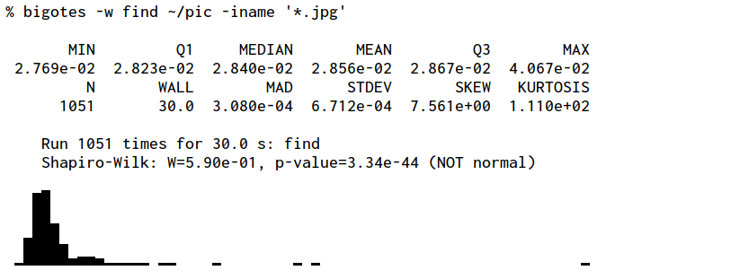
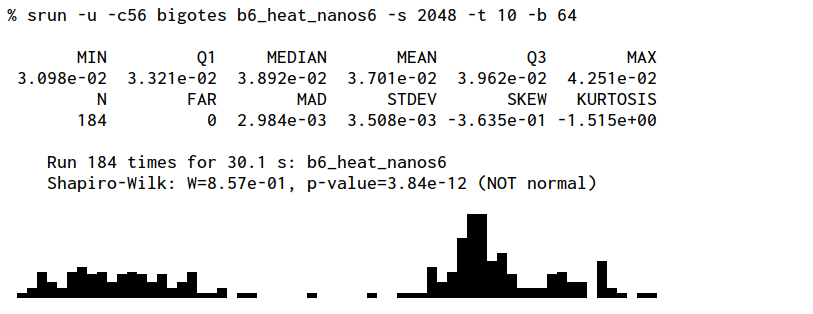
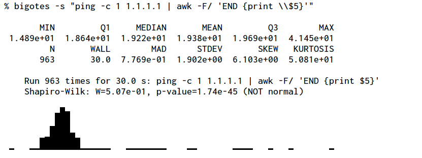
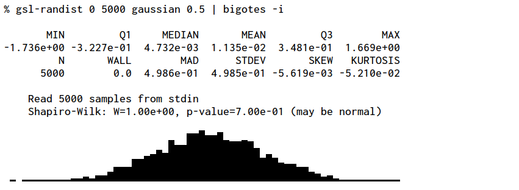

# Bigotes: Versatile benchmark tool

The bigotes program is a versatile tool designed to perform automatic benchmark
measurements and report statistical information. A single quantity is sampled
multiple times by either running again a given program or by reading the values
from the standard input. The typical quantity is the execution time, but others
can be used too.

The execution of the program is repeated until at least 30 samples are
collected and 30 seconds have elapsed. Both criteria must be met to stop
collecting samples.

At the end, a summary is shown with the number of samples collected
(RUN), the execution time (WALL), the five-number summary (MIN, Q1,
MEDIAN, Q3, MAX), the median average deviation (MAD), the relative MAD
to the median (%MAD) and the relative standard error of the mean (%SEM).
An histogram is plotted by using UTF-8 block characters and the results
of the Shapiro-Wilk test for normality.

See the bigotes(1) manual page for more details.

## Examples

- Measure the wall clock time taken by a command:

- Run a benchmark in a remote machine by using srun and use the value
written in the standard output as measured quantity:

- Ping a remote host and take the time as the measurement using a pipe
(note the escaping for the shell):

- Read the measurements from the standard input, generated by a Gaussian
distribution using the `gsl-randist` tool:

